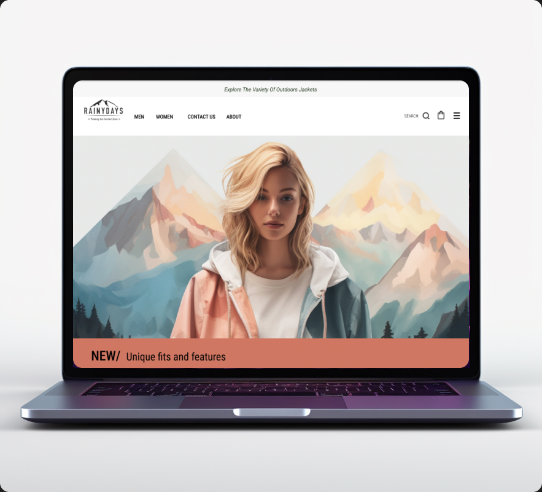

# Rainy-Days

A webpage with Rain Jackets for outdoors lovers



## Description

Cross-Course Project, Uniting all subjects throughout the year, this comprehensive endeavor culminates in a dynamic webpage for a jacket company. Hardcoded in Visual Studio Code, the site seamlessly integrates HTML and CSS, offering a sophisticated interface. Notably, it dynamically fetches product data from a headless WordPress setup, showcasing a synthesis of technical prowess and multi-disciplinary collaboration in this expansive cross-curricular initiative.

## Figma File for design

Link to Figma:
https://www.figma.com/file/Fl4Qw0uzzeaFw9CdMjqgLM/2022-09-22_design_CA_OlgaGoryszewska_RainyDays?node-id=407%3A1856

## Overview

This web page project is designed to showcase a collection of rain jackets. It includes information about different types of rain jackets, their features, and allows users to interact with the content.

## Features

- Display various rain jackets with images and detailed information featured from Word Press by REST API call.
- Provide a contact form for users to inquire about specific jackets.
- Utilize JavaScript for dynamic content and interactivity.

## Technologies Used

- HTML5
- CSS3
- JavaScript

## Getting Started

To run this project locally, follow these steps:

1. Clone the repository:

   ```bash
   git clone https://github.com/OlgaGoryszewska/Rainy-Days/tree/main/README

   ```

## Usage

1 Navigate to the index.html file in your browser.
2 Explore the collection of rain jackets.
3 Click on individual jackets for more details.
4 Visit the "Contact" page to inquire about a particular jacket.

## Contributing

If you'd like to contribute to this project, please follow these guidelines:

1 Fork the repository.
2 Create a new branch: git checkout -b feature-name.
3 Commit your changes: git commit -m 'Add a new feature'.
4 Push to the branch: git push origin feature-name.
5 Submit a pull request.

## License

This project is licensed under the devgoddess.no.

## Contact

For inquiries, please contact olga.goryszewska@gmail.com
